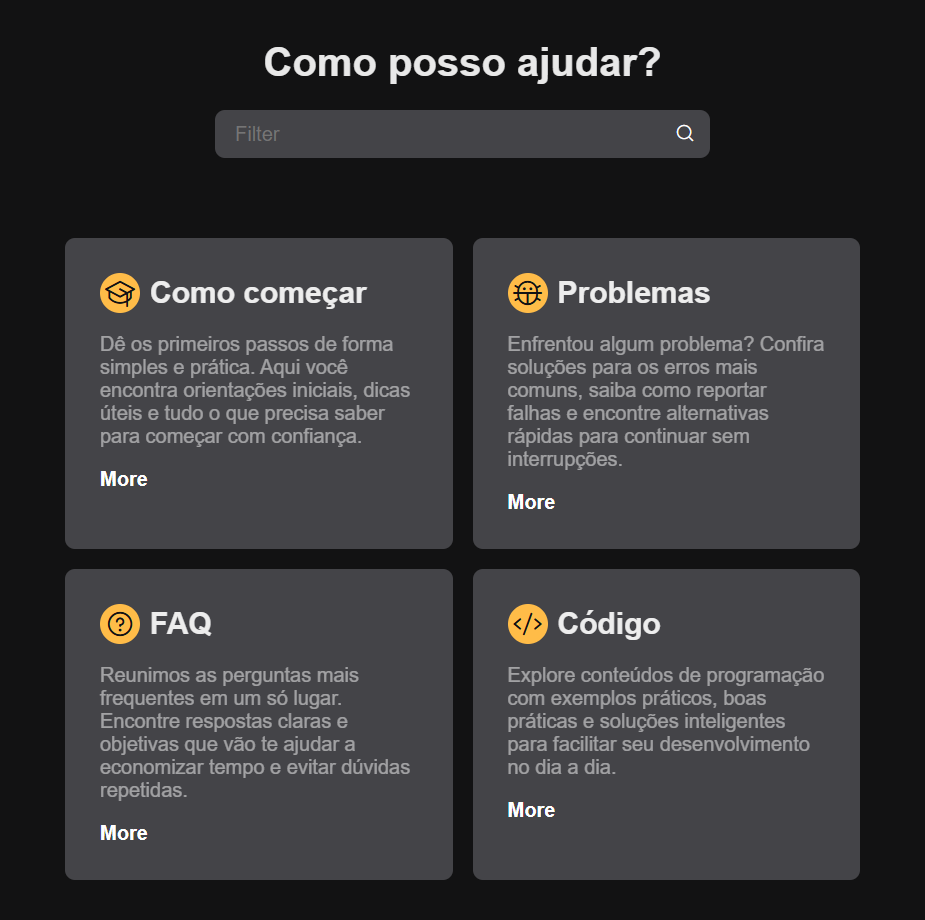

# 🔎 Projeto - Barra de Pesquisa Funcional

Este é um projeto pessoal desenvolvido com foco em **HTML, CSS e JavaScript**, onde implementei uma **barra de pesquisa funcional**.

A ideia principal foi praticar **estruturação, estilização responsiva e funcionalidades interativas**, garantindo uma boa experiência de usuário.

---

## 🚀 Tecnologias utilizadas

- **HTML5** → Estrutura semântica da aplicação.
- **CSS3** → Estilização moderna e responsiva para diferentes tamanhos de tela.
- **JavaScript (ES6+)** → Implementação da barra de pesquisa e funcionalidades interativas.

---

## ✨ Funcionalidades

✔️ Barra de pesquisa totalmente funcional  
✔️ Design responsivo para dispositivos móveis e desktops  
✔️ Cards com informações dinâmicas (_Como começar, Problemas, FAQ, Código_)  
✔️ Layout simples e intuitivo

---

## 📸 Demonstração

---

## 🌐 Acesse online

- 🎯 Veja o projeto rodando:
  [Clique aqui](https://bispo1307.github.io/Search-Bar/)

- 📁 Repositório no GitHub:
  [Clique aqui](https://github.com/Bispo1307/Search-Bar)

## 📌 Aprendizados

Durante o desenvolvimento, pratiquei:

- **Estruturação semântica** com HTML

- Criação de **layouts responsivos com CSS** (flexbox/grid)

- Manipulação do **DOM e eventos** no JavaScript

- Boas práticas de **organização e reaproveitamento de código**
